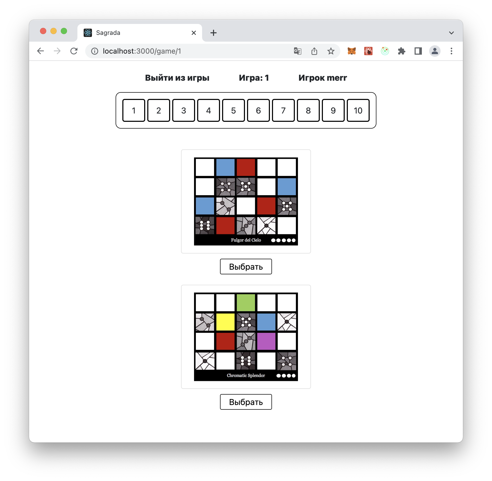
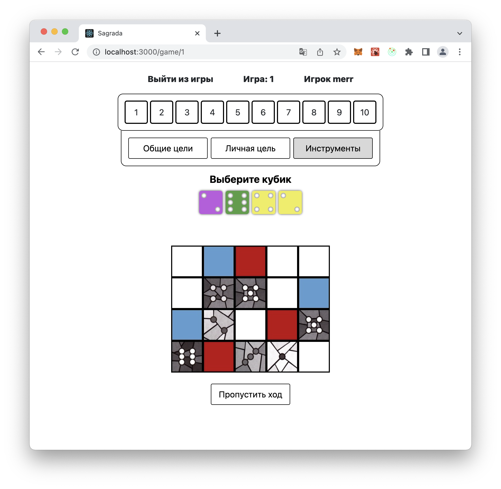
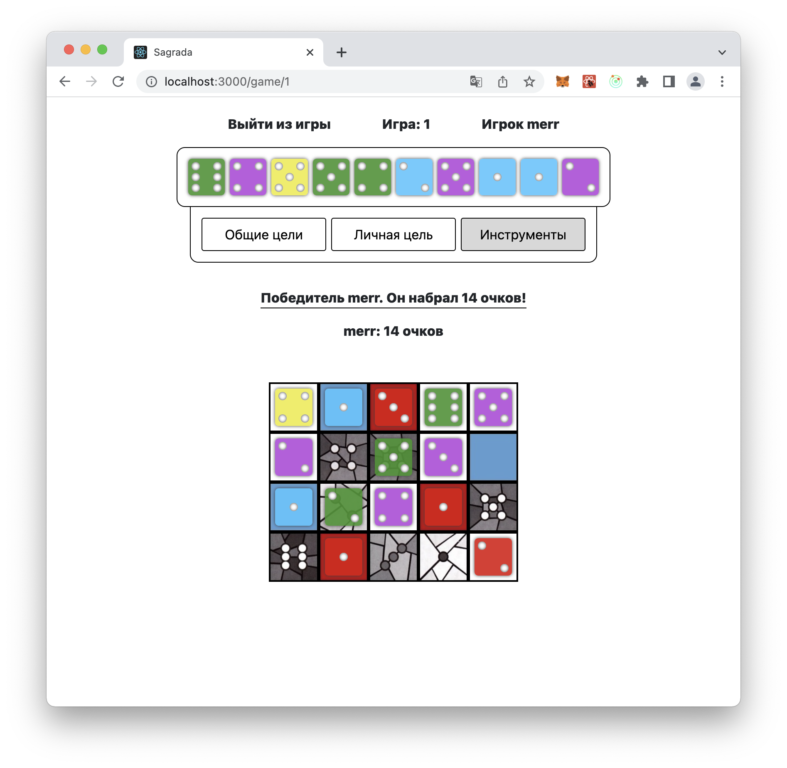
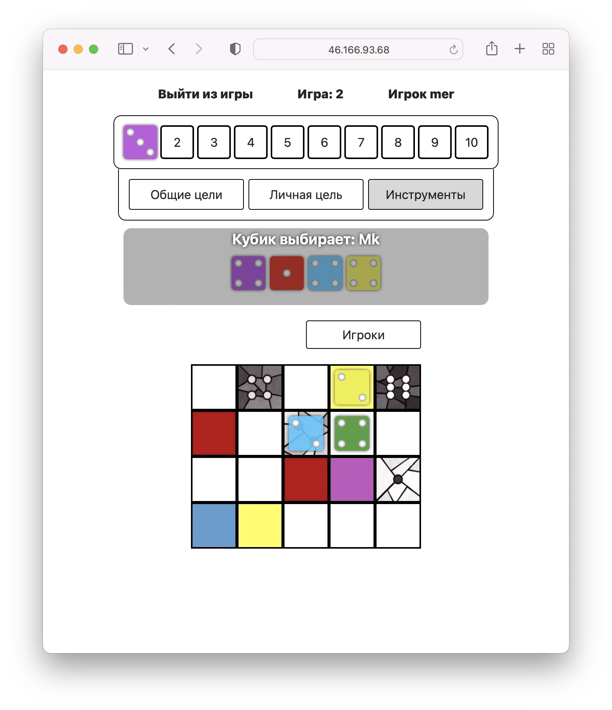
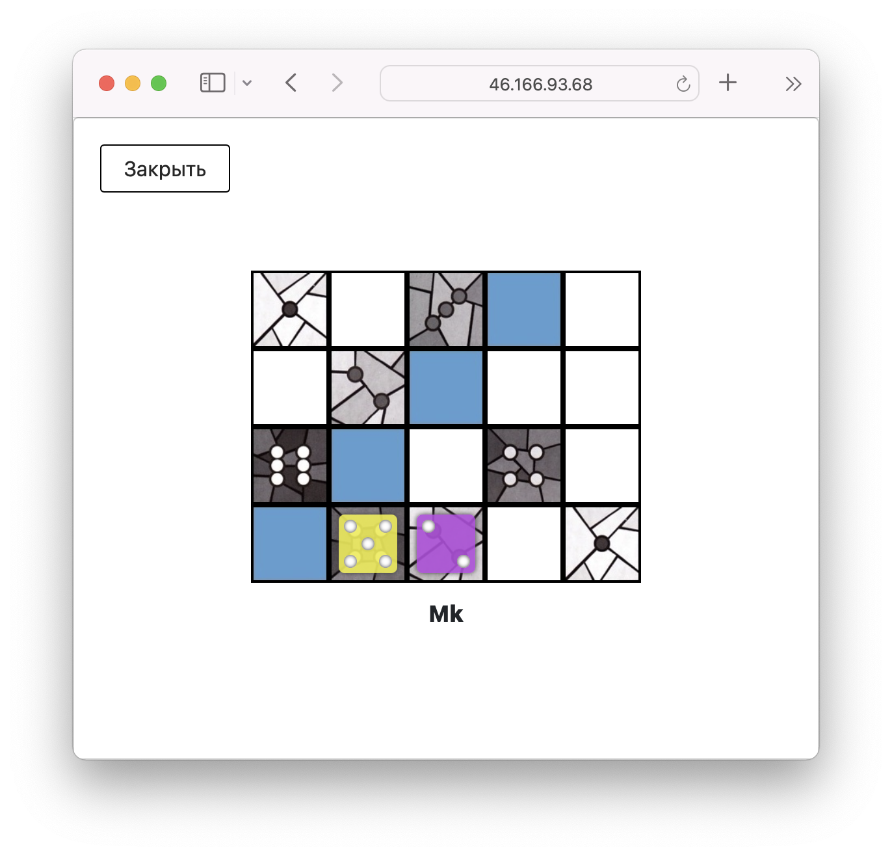

# sagrada-game
### 🖥 Stack:
Node.js, Express, PostgreSQL, Sequelize, Bcrypt, express-session, CORS, Socket.IO;
React, Redux (Toolkit, Thunk)

---

This is a group project we realized in a group of 3 developers. 
Original git history in the repository: https://github.com/IElizaI/Sagrada

Current version is deployed **[here](http://46.166.93.68:3010/main)** 

My responsibilities:
- react routing
- 'Main' component - main page with general navigation
- implementing game rules (a pdf document) into the website
- styles for 'Login', 'Registration', 'Players', 'Lobbies' components
- 'NavBar' component
- 'Dice' component - takes color and number as props and return a dice (client/src/components/game/Dice)
- 'Counter' component - has 10 empty cubes as total amount of rounds and when one round ends puts the round dice on the counter (client/src/components/game/Dice)
- logic of the rules when the player puts the dice on the board:
  - first dice must be placed on an edge or corner space,
  - every other dice must be adjacent to a previously placed dice, touching diagonally or orthogonally,
  - dice must match the color or value restriction of the space on the board,
  - dice may never be placed orthogonally adjacent to a dice of the same color or the same value
  (see in client/src/components/game/playersZone/CellPatternStainedGlass)

---

Sagrada is a game of “dice drafting and window crafting” where players compete to construct a stained glass window masterpiece while gaining extra prestige through the completion of public and secret objectives.

Sagrada takes its name from a place, the ‘Basílica i Temple Expiatori de la Sagrada Família’, aka Gaudi’s vast, unfinished church in Barcelona:

Before starting a game you can read the rules:

Players are given two window cards during set-up and can choose a window pattern from the four available sides – they all offer different dice placement options and vary in complexity:

Played in a series of 10 rounds, this abstract family game sees players drafting dice from a central pool and adding them to the window grid on their lavishly illustrated player boards.
When the game ends player sees his score:

You can play the game together with your friends online.
If there is more than one player, the players take dice one at a time, so you can't take an action if  it is not your turn:

But you can see what is going on on other players' windows:

---

Plans for further development:
- code refactoring
- results statistics
- design and adaptivity
- additional game features
